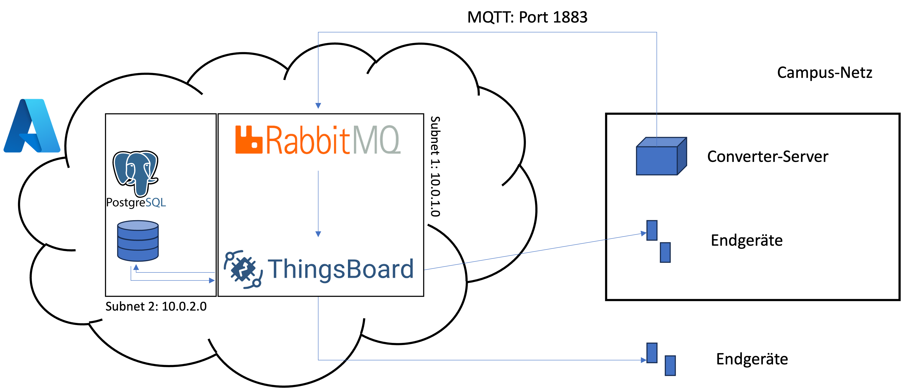

# Thingsboard on Azure

This repo provides terraform scripts which create and provision cloud resources on the Azure cloud to run thingsboard. Thingsboard utilizes the postgres SQL database which is hosted as a managed SQL server on Azure. Moreover, RabbitMQ server as message broker to receive all incoming MQTT requests, which are subscribed by the thingsboard client (in the same subnet). The below picture depicts the architecture:





After setting up terraform on your machine, a .tfvars file must be created, which specifies:
- admin_user (admin user of the vm hosting thingsboard)
- admin_password (admin password of the vm hosting thingsboard)
- rabbitmq_user (admin user of rabbitmq)
- rabbitmq_pw (admin user's password of rabbitmq)
- psql_user (admin user of postgres)
- psql_pw (admin user's password of postgres)


Then, the services can be created using 
```
terraform init
terraform plan -out "main.tfplan" -var-file="<PATH-TO-YOU-TFVARS-FILE>"
terraform apply "main.tfplan"
```

After that, the thingsboard platform is available on the assigned IP on port 8080 and the MQTT Broker on the same IP on port 1883.